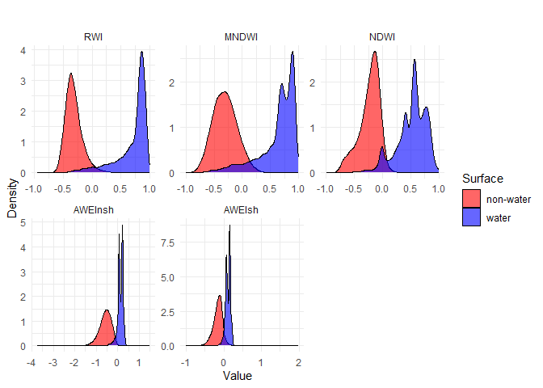

Implementation of RWI - Rescaled Water Index in R
================

## Description

This repository provides the implementation of the RWI (Rescaled Water
Index), a modification of the MNDWI, designed to enhance the mapping of
water surfaces (WSs) in urban areas using Sentinel-2 satellite imagery.

The RWI has shown promising results compared to widely used indices such
as NDWI, MNDWI, AWEIsh, and AWEInsh. Tests conducted in six South
American cities (São Paulo, Curitiba, Florianópolis, Porto Alegre,
Buenos Aires, and Viña del Mar) revealed that RWI achieved better
results in three locations and the best overall performance. Its primary
contribution lies in improving the detection of water bodies in urban
contexts and the delineation of coastal and riverine boundaries.

This R implementation is based on the paper: **“RWI: A New Spectral
Index for Mapping Aquatic Surfaces in Urban Contexts”**. The original
study, which proposed and evaluated the RWI, is available on EarthArXiv:
<https://eartharxiv.org/repository/view/7005/>. See the original
repository [here](https://github.com/edujusti/Rescaled-Water-Index-RWI).

### The RWI formula

The RWI is calculated as follows:

$$ 
RWI = \frac{Green^{e^{-1}} \cdot n^{-1} - Swir1}{Green^{e^{-1}} \cdot n^{-1} + Swir1}
$$

Where:

$$
n = \frac{m_{d}(Green^{(e^{-1})})}{m_{d}(Green)}
$$

- $Green$: Green band *(B03)* from Sentinel-2 imagery
- $Swir1$: Short-wave infrared band *(B11)* from Sentinel-2 imagery
- $m_{d}$: Median value of the region of interest
- $e$: Euler’s number

### R implementation of the RWI

``` r
# compute the n value for the region of interest
n_by_region <- function(x) {
  temp_df <- transform(x, 
                       B3Pow = B3^(1/exp(1)))
  
  temp_df <- apply(temp_df[, c("B3", "B3Pow")], 2, median, na.rm = TRUE)
  
  temp_df[[2]]/temp_df[[1]]
  
}
# compute the RWI
rwi <- function(green, swir1, n) {
  e <- exp(1)
  rwi <- (green^(1/e) / n - swir1) / (green^(1/e) / n + swir1)
  return(rwi)
}
```

### Data input from the original repository (availabe [here](https://github.com/edujusti/Rescaled-Water-Index-RWI/blob/main/samplePointsCities_20240811_harmonized.csv))

``` r
df_SR <- read.csv("data/samplePointsCities_20240811_harmonized.csv") 
dplyr::glimpse(df_SR)
```

    ## Rows: 123,780
    ## Columns: 9
    ## $ B2       <dbl> 0.0199, 0.0129, 0.0137, 0.0143, 0.0105, 0.0098, 0.0089, 0.015…
    ## $ B3       <dbl> 0.0282, 0.0227, 0.0262, 0.0284, 0.0225, 0.0209, 0.0167, 0.026…
    ## $ B4       <dbl> 0.0209, 0.0195, 0.0188, 0.0211, 0.0149, 0.0154, 0.0160, 0.016…
    ## $ B8       <dbl> 0.0130, 0.0152, 0.0201, 0.0149, 0.0176, 0.0130, 0.0159, 0.017…
    ## $ B11      <dbl> 0.0168, 0.0186, 0.0269, 0.0439, 0.0243, 0.0162, 0.0193, 0.015…
    ## $ B12      <dbl> 0.0149, 0.0132, 0.0183, 0.0299, 0.0143, 0.0146, 0.0152, 0.009…
    ## $ city     <chr> "Vina del Mar", "Vina del Mar", "Vina del Mar", "Vina del Mar…
    ## $ surface  <chr> "water", "water", "water", "water", "water", "water", "water"…
    ## $ classWat <chr> "coastal wetland", "coastal wetland", "coastal wetland", "coa…

#### The cities in the dataset

``` r
df_SR$city %>% janitor::tabyl()
```

    ##              .     n   percent
    ##   Buenos Aires 18200 0.1470351
    ##       Curitiba 15035 0.1214655
    ##  Florianopolis 14452 0.1167555
    ##   Porto Alegre 28887 0.2333737
    ##      Sao Paulo 27881 0.2252464
    ##   Vina del Mar 19325 0.1561238

#### Compute the RWI for a specific city

``` r
df_SR_splited <- df_SR %>%
  split(.$city)

sp_city <- df_SR_splited[[5]] # São Paulo

dplyr::as_tibble(sp_city) %>% head(20)
```

    ## # A tibble: 20 × 9
    ##        B2     B3     B4     B8    B11    B12 city      surface classWat       
    ##     <dbl>  <dbl>  <dbl>  <dbl>  <dbl>  <dbl> <chr>     <chr>   <chr>          
    ##  1 0.0287 0.0487 0.0253 0.0193 0.0233 0.0149 Sao Paulo water   artificial pond
    ##  2 0.0255 0.0414 0.0179 0.0127 0.0065 0.0074 Sao Paulo water   artificial pond
    ##  3 0.0236 0.0394 0.0178 0.0105 0.0085 0.0085 Sao Paulo water   artificial pond
    ##  4 0.0211 0.0297 0.0172 0.0178 0.006  0.0068 Sao Paulo water   artificial pond
    ##  5 0.0202 0.0234 0.0169 0.0179 0.0445 0.0346 Sao Paulo water   artificial pond
    ##  6 0.0249 0.0406 0.0195 0.0164 0.011  0.0117 Sao Paulo water   artificial pond
    ##  7 0.0197 0.0242 0.0136 0.0155 0.0116 0.0081 Sao Paulo water   artificial pond
    ##  8 0.0225 0.0319 0.0187 0.0671 0.0282 0.018  Sao Paulo water   artificial pond
    ##  9 0.0243 0.0405 0.0185 0.0134 0.0054 0.0072 Sao Paulo water   artificial pond
    ## 10 0.0252 0.0394 0.0204 0.016  0.0096 0.0057 Sao Paulo water   artificial pond
    ## 11 0.0257 0.0409 0.019  0.0117 0.0067 0.0041 Sao Paulo water   artificial pond
    ## 12 0.0242 0.041  0.0195 0.0102 0.01   0.0075 Sao Paulo water   artificial pond
    ## 13 0.0192 0.0274 0.0145 0.0154 0.0108 0.0042 Sao Paulo water   artificial pond
    ## 14 0.0217 0.0278 0.0155 0.0328 0.0457 0.0282 Sao Paulo water   artificial pond
    ## 15 0.0248 0.0436 0.0196 0.0152 0.0086 0.0065 Sao Paulo water   artificial pond
    ## 16 0.0245 0.0415 0.017  0.0123 0.0068 0.0059 Sao Paulo water   artificial pond
    ## 17 0.023  0.0296 0.0146 0.0135 0.0092 0.0059 Sao Paulo water   artificial pond
    ## 18 0.0243 0.043  0.0172 0.0198 0.0134 0.0062 Sao Paulo water   artificial pond
    ## 19 0.0189 0.0369 0.016  0.0233 0.0123 0.0093 Sao Paulo water   artificial pond
    ## 20 0.0234 0.0413 0.0199 0.0146 0.01   0.0085 Sao Paulo water   artificial pond

#### Compute the RWI for São Paulo

``` r
sp_city_rwi <- transform(sp_city, 
                         RWI = rwi(B3, B11, 
                                   n_by_region(sp_city))
                         )


# Compute the range of RWI values for each surface type
sp_city_rwi %>% split(.$surface) %>% 
  lapply(function(x) {
    range(x$RWI)
      }) %>% as.data.frame() %>% 
  t() %>% as.data.frame() %>%
  dplyr::rename(RWI_min = V1, RWI_max = V2)
```

    ##              RWI_min   RWI_max
    ## non.water -0.6921607 0.5658038
    ## water     -0.3412029 0.8915109

#### Plot the RWI vs surface type for São Paulo

``` r
sp_city_rwi %>% 
  dplyr::mutate(surface = as.factor(surface)) %>%
  ggplot2::ggplot(aes(x = RWI, fill = surface)) +
  ggplot2::geom_density(alpha = 0.6) +
  labs(title = " ",
       x = "RWI Value",
       y = "Density") +
  scale_fill_manual(values = c("water" = "blue", "non-water" = "red")) +
  labs(fill = "Surface") +
  theme_minimal()
```

<!-- -->

### Running the RWI for all the cities

``` r
df_SR_rwi <- do.call(rbind,
                     lapply(df_SR_splited, \(x) {
                       transform(x,
                                 RWI = rwi(B3, B11, n_by_region(x)))
                       }))

df_SR_rwi %>% split(.$surface) %>% 
  lapply(function(x) {
    range(x$RWI)
      }) %>% as.data.frame() %>% 
  t() %>% as.data.frame() %>%
  dplyr::rename(RWI_min = V1, RWI_max = V2)
```

    ##              RWI_min   RWI_max
    ## non.water -0.9422513 0.5658038
    ## water     -0.5333735 0.9970163

### Plot the RWI vs surface type for all cities

``` r
df_SR_rwi %>% 
  mutate(surface = as.factor(surface),
         city = as.factor(city)) %>%
  ggplot2::ggplot(aes(x = RWI, fill = surface)) +
  ggplot2::geom_density(alpha = 0.6) +
  ggplot2::facet_wrap(~city, scales = c("fixed", "free")[2]) +
  labs(title = "",
       x = "RWI Value",
       y = "Density") +
  scale_fill_manual(values = c("water" = "blue", "non-water" = "red")) +
  labs(fill = "Surface") +
  theme_minimal()
```

<!-- -->

## Comparison with other indices

``` r
df_SR_all <- df_SR_rwi %>%
  dplyr::mutate(NDWI = ndwi(B3, B8),
                MNDWI = mndwi(B3, B11),
                AWEIsh = AWEIsh(B2, B3, B8, B11, B12),
                AWEInsh = AWEInsh(B2, B3, B8, B11, B12))

# get the range of the indices
df_SR_all %>% split(.$surface) %>% 
  lapply(function(x) {
    x[10:13] %>% 
      apply(2, function(x) range(x))
      }) %>% as.data.frame() %>%
  t() %>% as.data.frame() %>%
  dplyr::rename(Index_min = V1, Index_max = V2)
```

    ##                   Index_min Index_max
    ## non.water.RWI    -0.9422513 0.5658038
    ## non.water.NDWI   -0.9967897 0.5400000
    ## non.water.MNDWI  -0.9990015 0.5236884
    ## non.water.AWEIsh -1.0052500 1.9856000
    ## water.RWI        -0.5333735 0.9970163
    ## water.NDWI       -0.7377239 0.9967949
    ## water.MNDWI      -0.8246753 0.9972222
    ## water.AWEIsh     -0.4876750 0.2897250

### Plot the density of the indices for all cities

``` r
df_SR_all %>% dplyr::select(RWI, NDWI, MNDWI, AWEIsh, AWEInsh, surface) %>%
  tidyr::pivot_longer(cols = -surface, names_to = "index", values_to = "value") %>%
  dplyr::mutate(surface = as.factor(surface),
         index = factor(index, levels = c('RWI', 'MNDWI', 'NDWI', 'AWEInsh', 'AWEIsh'))) %>%
  ggplot2::ggplot(aes(x = value, fill = surface)) +
  ggplot2::geom_density(alpha = 0.6) +
  ggplot2::facet_wrap(~index, scales = c("fixed", "free")[2]) +
  labs(title = " ",
       x = "Value",
       y = "Density") +
  scale_fill_manual(values = c("water" = "blue", "non-water" = "red")) +
  labs(fill = "Surface") +
  theme_minimal()
```

<!-- -->

### Base reference

**This work is based on the following paper:** Eduardo Justiniano,
Fernando kawakubo, Edimilson dos Santos Júnior, Breno de Melo, Gustavo
Menezes, Marcel Fantin, Julio Pedrassoli, Marcos Martines, Rúbia Morato,
August 20, 2024, “RWI”, IEEE Dataport, doi:
<https://dx.doi.org/10.21227/1ybz-1y91>.
